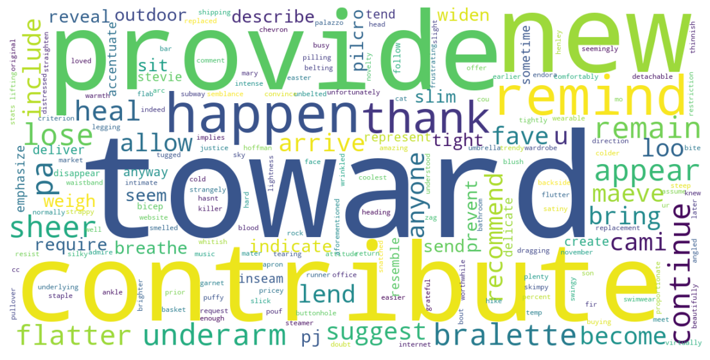

# Sentimet-Analysis-NLP

This project focus on sentiment analysis using Natural Language Processing (NLP). The goal of the project is to analyze and classify sentiments written in English reviews. 

## Used Libraries 
- `numpy`- `pandas`- `matplotlib`- `seaborn`
- `NLTK`- `wordcloud`- `optuna`- `transformers`
- `scikit-learn`- `tensorflow` - `keras`

## Run the project 

The repository includes a Jupyter notebook which you can run on your local machine or you can use Google Colab.

## Results 

For an in-depth results and analysis of sentiment patterns, please refer to the Jupyter notebook available in this repository.

## Acknowledgements

- This project is part of ML bootcamp provided by <a href="https://clarusway.com/"> Clarusway</a>.

